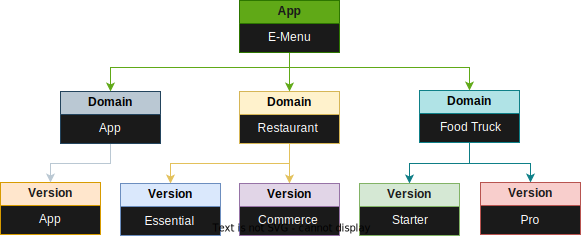

# Versions
<!--@include: includes/alpha-note.md-->

App versions are containers of features, organizing account-level application functionality (e.g. Basic, Advanced, Professional). While accounts may have access to multiple versions, they can only subscribe to one at any given time.

See the [architecture](architecture) page for additional information.

## Creating versions

Versions are fully managed using the Backstack dashboard, including their assignment to domains with prescribed feature access. Resulting configurations are included in the [app schema](app-schemas) for use within your codebase.

## Example versioning

| Version | Description |
| --- | --- |
| `Basic` | Provides access to basic application functionality. This version of your application could be free. |
| `Advanced` | Provides all the functionality of the Basic version plus additional features. You'll probably assign a fee to this version. |
| `Premium` | Provides all the functionality of the Advanced version plus additional features. You'll probably assign a fee to this version. |

## Monetizing versions

<!--@include: includes/auto-invoiced-fees.md-->

See [invoicing-accounts](invoicing-accounts) for additional information.

## Allowing accounts to select versions

Manage version configurations through the Backstack dashboard. Allow accounts to select their preferred version using your user interface, leveraging pre-configured app schema data and the API.

<!--@include: includes/version-list.md-->

See the [version assignment workflow](version-assignment) for incorporating account-based version management into your UI.

## The Version object

<!--@include: includes/objects/version.md-->
<!--@include: includes/objects/properties/version.md-->

